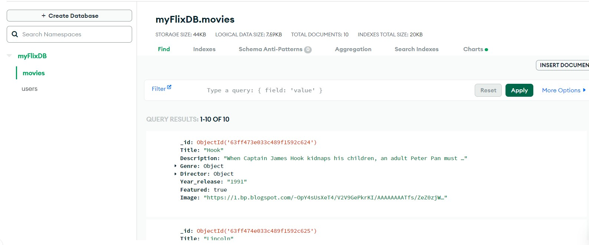

  <h1 align="center">Movie_API</h1>

  <p align="center">
    This is the communication layer (RESTful API) that handles HTTP requests and communicates with a MongoDB database of movie and user data. For details about API endpoints, visit the <a href="https://movie-api-gas8.onrender.com/documentation" target="_blank">documentation</a>.
  </p>
</div>
<br />

<!-- TABLE OF CONTENTS -->

<details>
  <summary>Table of Contents</summary>
  <ol>
    <li>
      <a href="#about-the-project">About The Project</a>
      <ul>
        <li><a href="#key-features">Key Features</a></li>
        <li><a href="#built-with">Built With</a></li>
        <li><a href="#deployments">Deployments</a></li>
      </ul>
    </li>
    <li>
      <a href="#getting-started">Getting Started</a>
      <ul>        
        <li><a href="#installation">Installation</a></li>
        <li><a href="#quick-start">Quick Start</a></li>
        <li><a href="#ux-notes">UX Notes</a></li>
      </ul>
    </li>
  </ol>
</details>

<!-- ABOUT THE PROJECT -->

## About The Project

<!-- SCREENSHOT -->



[Movie_API Repository](https://github.com/Mcelest19/movi_api)

<!-- KEY FEATURES -->

### Key Features

1. JWT Authentication, password hashing, and secure user logins.
2. View information about movies, genres, and directors.
3. Create a user account with a username and password
3. View information about a user (credentials required)

<!-- BUILT WITH -->

### Built With

- HTML, CSS, JavaScript
- MongoDB
- Express
- Node.js

<p align="right">(<a href="#readme-top">back to top</a>)</p>

<!-- DEPLOYMENTS -->
## Deployments

Date Night Movies (API) is currently live and hosted with GitHub Pages. This RESTful API is the communication layer for two Date Night Movies frontend deployments, one developed with React and one developed with Angular.

- [Movie API](https://github.com/Mcelest19/movi_api)

- [myFlix-client React Frontend](https://famous-otter-8efa34.netlify.app/)

- [myFlix-Angular-client Frontend]( https://mcelest19.github.io/myFlix-Angular-client/)


<p align="right">(<a href="#readme-top">back to top</a>)</p>

<!-- INSTALLATION -->

### Installation

1. Clone the repo

   ```sh
   git clone https://github.com/Mcelest19/movi_api.git
   ```

<p align="right">(<a href="#readme-top">back to top</a>)</p>

<!-- QUICK START -->

### Quick Start

After installation...

1. Start the Node server locally by running the following:

   ```sh
   npm run start
   ```

2. Now, with [Postman](https://www.postman.com/downloads/), or a similar API platform of choice, you may test the API endpoints found in the [documentation](https://movie-api-gas8.onrender.com/documentation)

<p align="right">(<a href="#readme-top">back to top</a>)</p>

<!-- UX NOTES -->

## UX Notes

- You'll need to create an account by sending a `POST` request to the `/users` endpoint with your desired "Username", "Password", "Email", and "Birthday" (ISO date) key/values in a JSON object in the request body.
- Upon successful account creation, the response body will show a JSON Object of the created user.
- Now you can login by sending a `POST` request to the `/login` endpoint with the `Username` and `Password` key/values as parameters (with an empty request body).
- A successful login request will show user data in a JSON object.
- Copy the value found in `token`, then use it in a separate API requests (found in the [documentation](https://datenightmovies.herokuapp.com/documentation)) by pasting it in the Authorization tab, Type: "Bearer Token", Token: `paste token here`.

<p align="right">(<a href="#readme-top">back to top</a>)</p>


